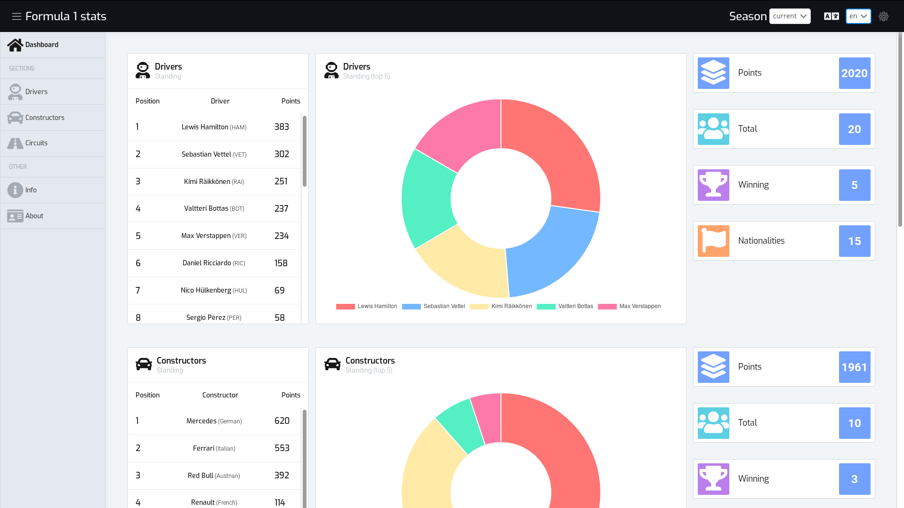
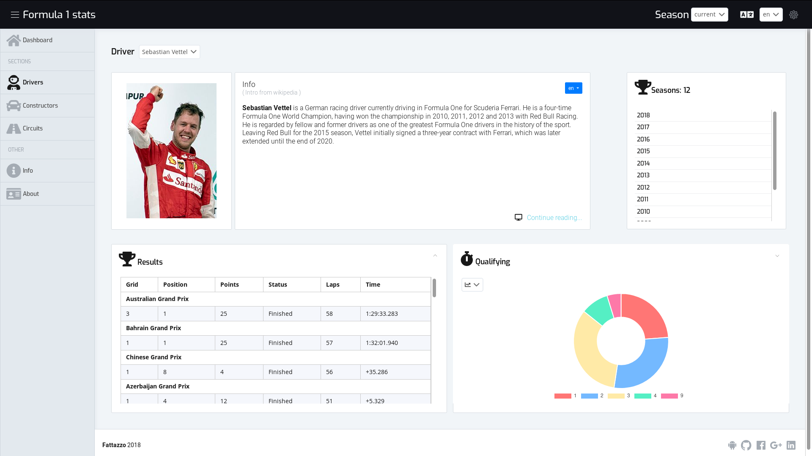
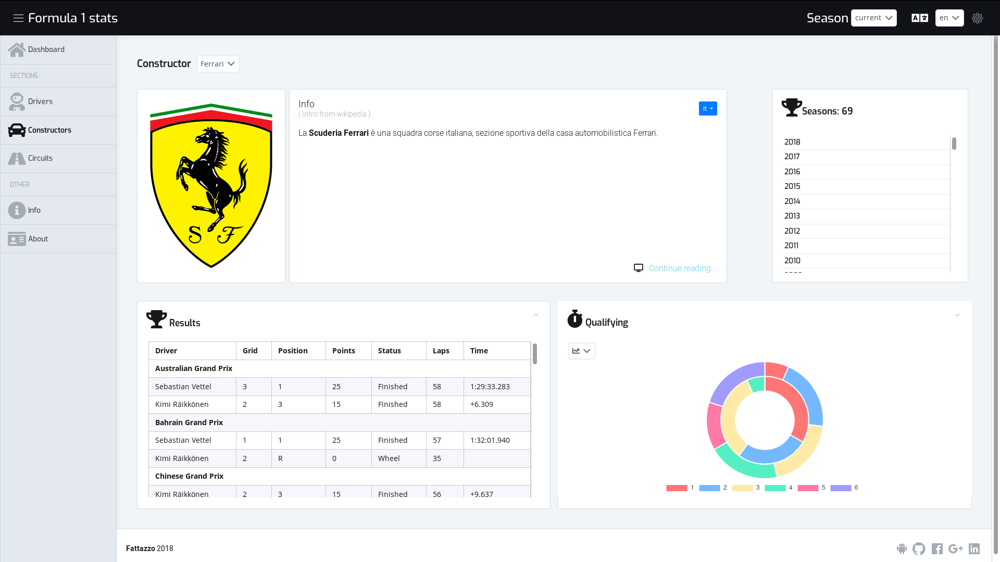
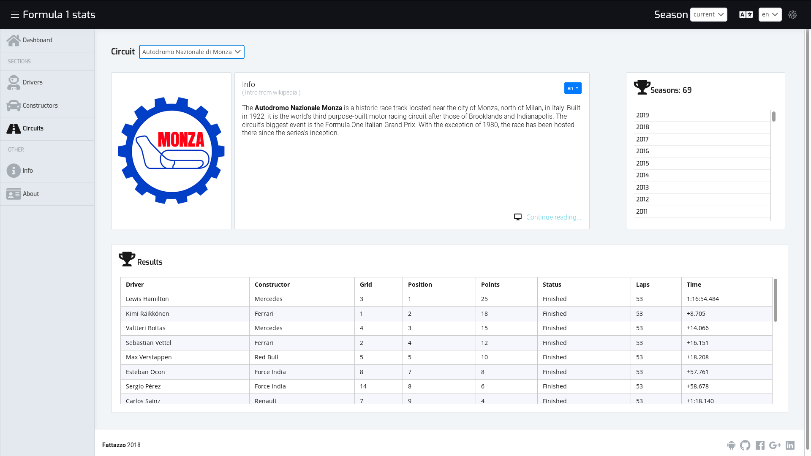
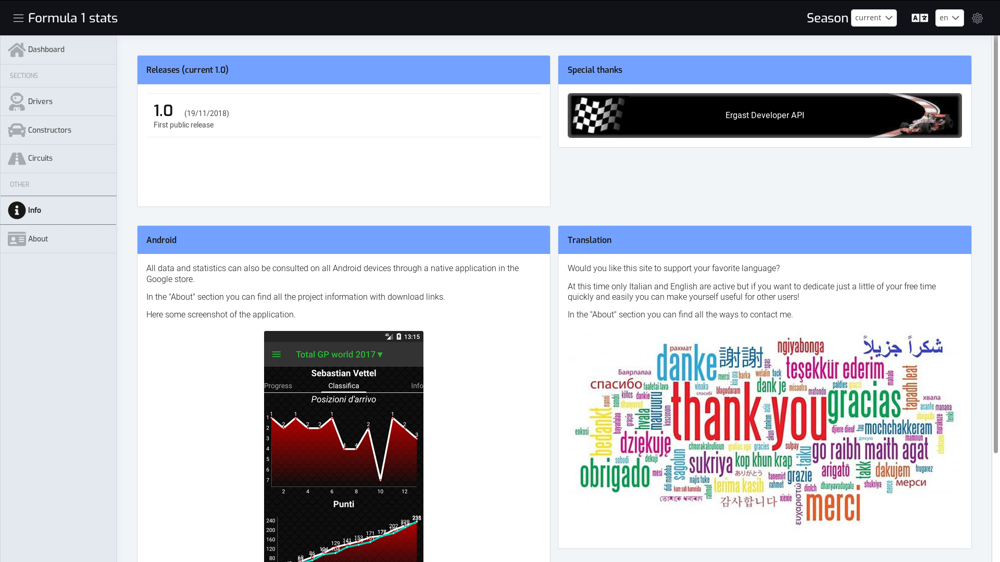

# :racing_car: Total GP world: results, rankings, updated timetables and comparisons from the season 1950 to the present.

### :checkered_flag: Goals
- **Responsive**: the layout fits for the web browser, tablet or smartphone.

- **Fast**: each call is cached until the season is changed, so only the first time the data are loaded remotely. This means less data usage and more browsing speed.

- **Collaborative**: At this time only :it: Italian and :gb: English are supported but everyone can contribute by adding their own language.

- **Open**: The project is totally open so everyone can contribute or
create a new one starting from the existing one. Anyone who does not know the programming will still be able to request new features that I will try to achieve.

### :question: Issues

For any bug, proposal or new feature open new issue <a href="https://github.com/fattazzo/total-gp-world-web/issues/new" target="_blank">:link:here</a>  or go to issues section of project to see those that are already present.

:information_source: **Remember**: __Before creating a new bug check__ that it is not already present and use the __appropriate labels__ (bugs, enhancement, question, etc ...). <a href="https://github.com/fattazzo/total-gp-world-web/labels" target="_blank">:link:Here</a> a list of available labels

### :globe_with_meridians: Live web app url:
<a href="https://fattazzo.github.io/total-gp-world-web" target="_blank">https://fattazzo.github.io/total-gp-world-web</a>

### :globe_with_meridians: Live unstable web app url:
<a href="https://total-gp-world-web.netlify.com/" target="_blank">https://total-gp-world-web.netlify.com</a>

:warning: **WARNING**

This link go to an unstable version of the web app that are generate every single commit from the code that is currently in development.

This means that many bugs may be present, some features may not work properly or the whole site will not be available.

### :framed_picture: Screenshots

